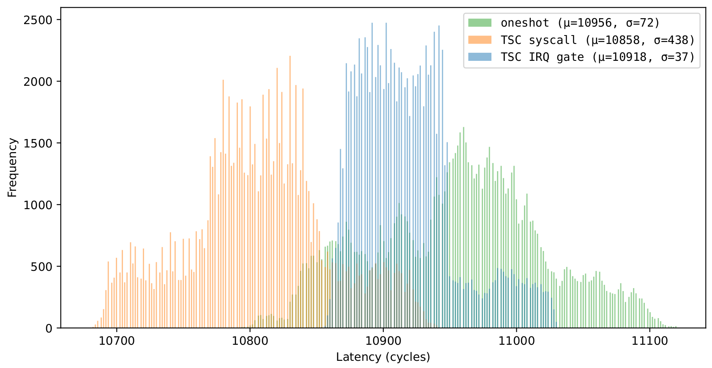

# APIC Precision Microbenchmarks

This directory contains the experiments to determine the accuracy of the local
APIC timer, as described in Appendix A of the [AEX-Notify
paper](https://jovanbulck.github.io/files/usenix23-aexnotify.pdf).

The local APIC timer can be configured in one-shot or periodic mode to send an
interrupt when an MMIO counter register reaches zero, or in TSC-deadline mode
when the processor's timestamp counter exceeds a value specified in the
dedicated `IA32_TSC_DEADLINE_MSR` model-specific register.  Depending on the
processor model, the APIC timer operates at the frequency of either the
processor’s bus clock or its core crystal clock. Neither time source is
synchronized with the core clock, which typically operates at a much higher
frequency (e.g., more than 100x higher).

**TSC-Deadline Mode.** As a contribution of independent interest, we devised an
improved setup to considerably reduce the noise from additional kernel context
switches. For this, we registered a custom ring-0 interrupt gate in the
processor's interrupt-descriptor table. This allows to essentially bypass the
OS kernel altogether by directly invoking a minimal assembly handler that
programs a specified value in `IA32_TSC_DEADLINE_MSR` using the privileged
`WRMSR` instruction via a software interrupt. 

**Comparison Results.** We conclude that our novel interrupt-gate TSC-deadline
timer configuration technique yields a considerable improvement in terms of
standard deviation of elapsed cycles for both the existing one-shot technique
that SGX-Step currently uses, as well as naive kernel-level configuration
approaches (cf. as is also visually evident in the figure below)

